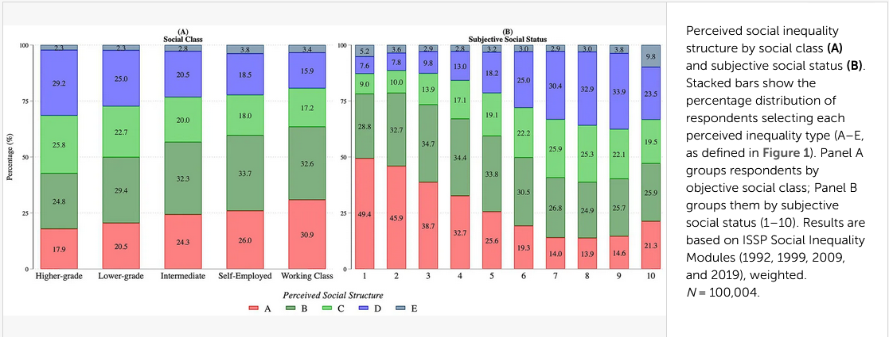

# Selección de artículo/reporte

- Referencia del artículo seleccionado
- Breve resumen del artículo seleccionado
- Justificación de la selección del artículo

# Evaluación de reproducibilidad

Análisis detallado del artículo seleccionado, evaluando los siguientes aspectos:

  -   **Disponibilidad de datos**: ¿El artículo proporciona acceso a los datos utilizados en el estudio? Si no es así, ¿qué dificultades se enfrentaron para obtener los datos?
  -   **Disponibilidad de código**: ¿El artículo proporciona acceso al código utilizado para el análisis? Si es así, ¿cómo se puede acceder?
  -   **Documentación**: ¿El artículo incluye una descripción clara de los métodos y procedimientos utilizados en el estudio? ¿Es suficiente para que otro investigador pueda replicar el estudio?
  -   **Transparencia**: ¿El artículo proporciona información sobre los posibles conflictos de interés, financiamiento, y otros aspectos relacionados con la transparencia de la investigación?   

# Análisis reproducible

Seleccionar un resultado específico del artículo (por ejemplo, una tabla de resultados o una figura) y tratar de reproducirlo utilizando los datos y el código proporcionados. Documentar el proceso de reproducción, incluyendo cualquier dificultad encontrada y cómo se resolvió.

## Resultado a reproducir

La figura que se busca reproducir corresponde a un gráfico de barras apiladas que muestra la distribución de la percepción de desigualdad social en función de la clase social objetiva y el estatus social subjetivo. El gráfico se divide en dos paneles, uno para cada variable independiente, y muestra la proporción de personas que perciben desigualdad social en cada categoría de clase social objetiva y estatus social subjetivo.




## Proceso de reproducción

- Descripción detallada del proceso seguido para reproducir el resultado seleccionado, incluyendo los pasos realizados, las herramientas utilizadas, y cualquier ajuste necesario para lograr la reproducción. Incluye las siguientes sub secciones:

### Procesamiento

- Incluye el código utilizado para procesar los datos, junto con una explicación de cada paso. 

- Los datos originales deben ser llamados desde input/data/original, el código de procesamiento se debe incluir en este mismo archivo (reporte-repro.qmd).

```{r}
#| warning: false

# Cargar librerias
if (!require("pacman")) install.packages("pacman") # instalar pacman
                            # cargar librerias
pacman::p_load(dplyr,       # Manipulacion de datos 
               haven,       # importar datos en .dta o .sav
               car,         # recodificar variables
               sjlabelled,  # etiquetado de variables
               sjmisc,      # descriptivos y frecuencias
               sjPlot,      # tablas, plots y descriptivos
               summarytools,
               knitr # resumen de dataframe
               )

# Cargar datos
issp <- read_sav("input/data/original/ZA8790_v1-0-0.sav")

# Valores perdidos
issp <- issp %>%
  mutate(across(everything(), ~ ifelse(. %in% c(-9, -8, -7, -4, -3, -1), NA, .)))
```


```{r clases_diagrama}
#| warning: false

issp %>%
  descr(v54) %>%
  as.data.frame() %>%
  kable(digits = 2, caption = "Estadísticos descriptivos de v54")
```
### Reproducción

- Generación de tabla o figura a reproducir.

# Conclusiones

Basándose en el análisis realizado, escriban una conclusión sobre el nivel de reproducibilidad del artículo seleccionado.

# Recomendaciones

Recomendaciones para mejorar la reproducibilidad del artículo, si es necesario.

# Referencias

::: {#refs}
:::

# Apéndice

## Material suplementario

- Incluyan aquí detalles metodológicos adicionales, en caso de ser necesario

## Código

- Incluir acá el código original, en caso de estar disponible.


